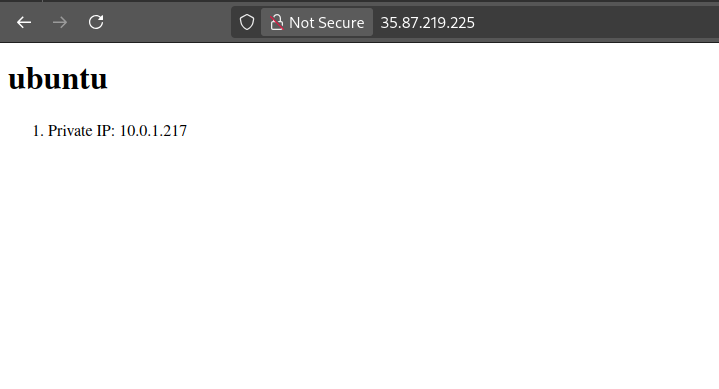

## Prerequisites

1. AWS EC2 instances with the appropriate tags:
  - Redis servers tagged with 'role=redis-server'
  - Frontend servers tagged with 'role=frontend-server'
2. SSH key uploaded with the provided script

## Running the playbook

```bash
# To run the playbook on all servers
ansible-playbook playbook.yml

# To run only on Redis servers
ansible-playbook playbook.yml --limit server_role_redis_server

# To run only on Frontend servers
ansible-playbook playbook.yml --limit server_role_frontend_server

# To test the playbook without making any changes
ansible-playbook playbook.yml --check
```
